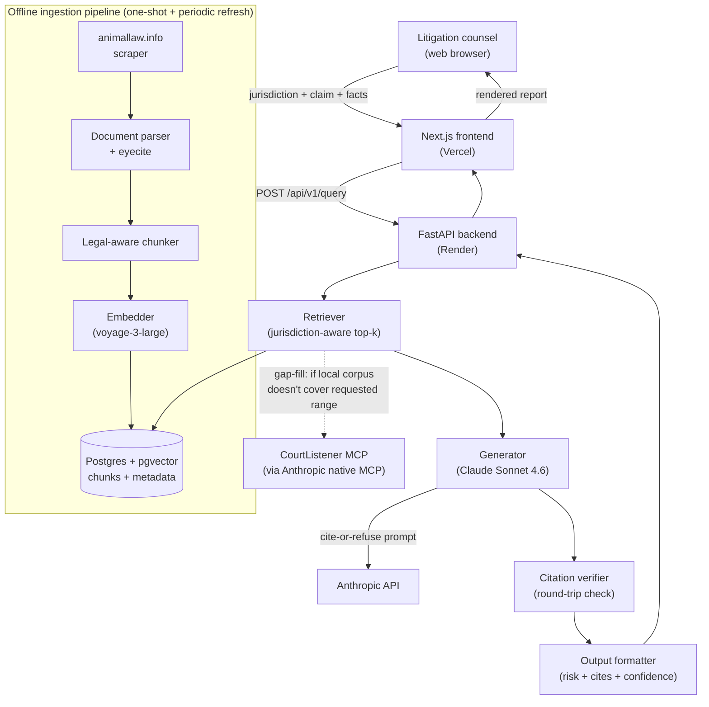

# Day 3 — System Design

**Project:** Litigation Prediction and Strategy (Open Paws RDP)
**Stage:** 2 — Design & Architecture
**Date:** 2026-05-25
**Note:** Revised after live discussion with mentor (intern). Supersedes the earlier draft.

---

## 1. System architecture

### Shape of a single query (retrieve → generate → verify)

A user lands on the website, opens the **Analyze** page, fills out a short form (jurisdiction, legal claim, facts), and submits. That submission travels from the Next.js frontend on Vercel to the FastAPI backend on Render. The backend embeds the query and searches the local case-law database (Postgres + pgvector) for the most relevant chunks of animal-law cases. If the user has enabled the **CourtListener toggle** and specified a date range, the backend checks whether the local corpus covers that range for the target jurisdiction (using `MAX(decision_date)` scoped to that jurisdiction). If there is a gap — meaning the local DB's latest case date falls short of the requested range end — the backend calls **CourtListener MCP** to fetch only the missing cases (from `latest_local_date` up to `date_range.end`), merges those results into the retrieval pool, and re-ranks before selecting the top-k. This supplementation always fires when the toggle is on and a gap exists, regardless of how many local results were already found. The combined top-k chunks + the question then go to **Claude Sonnet 4.6** under a strict *cite-or-refuse* contract; Claude's draft response is then run through a verifier that checks each citation traces back to a real retrieved chunk. Verified output is returned to the frontend and rendered as a structured report (risk factors, comparable cases, strategic considerations, confidence band).

Each query is independent. No conversation memory, no chatbot.

### Diagram



### The user-facing surface (six pages)

1. **Home (`/`)** — landing page. Hero, one-sentence value prop, "what makes this different" block (verified citations, calibrated refusal, open source), CTA to Analyze.
2. **Analyze (`/analyze`)** — the actual product. Form + structured report. The only page that calls the backend.
3. **How it works (`/how-it-works`)** — trust page. Pipeline walkthrough, Stanford research, frank "what we can't do yet."
4. **Sources (`/sources`)** — transparency. What's in the corpus, attribution, licensing, refresh cadence, doc counts.
5. **About & Limitations (`/about`)** — Open Paws context, disclaimers (UPL, "not legal advice"), GitHub link, contact.
6. **Examples (`/examples`)** — pre-run query gallery showing strong outputs and refusal cases. Static content, no backend call.

Shared layout: header with nav, footer with links. Tailwind + shadcn/ui design system across all six.

### Offline vs. online

**Online (per query):** retrieve → generate → verify → format → return.

**Offline (not at query time):** ingestion. Scrape animallaw.info, parse with eyecite, chunk in a legal-aware way (preserving captions, holdings, etc.), embed with voyage-3-large, write to Postgres+pgvector. Runs once for the initial seed, then on a refresh schedule.

---

## 2. Tech stack

| Layer | Choice | Why |
|---|---|---|
| **Frontend framework** | Next.js (React + TypeScript) | Multi-page polished site with shared design system; routing + SSR + Vercel deploy out of the box. |
| **Styling** | Tailwind CSS + shadcn/ui | Professional design system without bespoke design work; accessible components. |
| **Frontend hosting** | Vercel | Native Next.js host; preview deploys per branch; free tier sufficient. |
| **Backend framework** | FastAPI (Python 3.12) | Async, typed, auto-generated OpenAPI docs; aligns with Python's AI/legal-NLP ecosystem. |
| **Backend hosting** | Render | One-dashboard FastAPI + managed Postgres; Git-push deploy; generous free tier. |
| **Python package manager** | uv | Fast, deterministic installs; saves real time vs. pip. |
| **Database** | Postgres 16 + pgvector | One system for relational + vector; trivial to self-host; sufficient scale for our corpus. |
| **LLM** | Claude Sonnet 4.6 (Anthropic) | Long context for legal docs, strong citation behavior, native MCP support. |
| **Embeddings** | voyage-3-large | Top retrieval quality in 2026; Anthropic-recommended; cheap. |
| **Citation parsing** | eyecite | Standard US-legal citation parser, maintained by Free Law Project (the org that runs CourtListener). |
| **Live case law (optional)** | CourtListener MCP | Available natively inside Claude as of May 2026; removes ingestion plumbing for current cases. |
| **Scraping** | httpx + selectolax | Static HTML on animallaw.info; no Selenium needed. |
| **Dev environment** | Docker Compose | One command for fresh-clone setup (Postgres + backend). |
| **Backend testing** | pytest | Default. |
| **Frontend testing** | Vitest | Default for Vite-powered Next.js setups. |
| **Migrations** | Alembic | Default for SQLAlchemy. |

Deliberately out of scope for Phase 1:
- **Auth, multi-tenancy, user accounts** — Phase 2 per the brief.
- **Document upload** — Phase 2 per the brief.
- **Fine-tuning** — out of intern budget; RAG + frontier model beats it on legal QA anyway.
- **Alternative vector DBs (Qdrant, Weaviate)** — pgvector handles our scale; one fewer service to operate.

---

## 3. Data model

Five tables. Lowercase + snake_case. All have `created_at`, `updated_at`. Primary keys are UUIDs.

### `documents`
One legal document — a case opinion, statute, regulation, or editorial article from animallaw.info.

| Column | Type | Notes |
|---|---|---|
| `id` | uuid | PK |
| `source` | text | `'animallaw.info'`, `'courtlistener'`, `'cap'` |
| `source_id` | text | External ID at the source. Unique with `source`. |
| `doc_type` | text | `'case'`, `'statute'`, `'article'`, `'regulation'` |
| `jurisdiction` | text | Normalized: `'US'`, `'US-CA'`, `'US-9th-Cir'`, etc. |
| `court` | text | Court name (nullable for non-case docs) |
| `decision_date` | date | Nullable |
| `title` | text | Case caption or statute title |
| `citation` | text | Bluebook-normalized cite |
| `full_text` | text | Cleaned full text |
| `source_url` | text | Link back to original |
| `metadata` | jsonb | Judge, panel, parallel cites, etc. |

### `chunks`
A semantically-bounded slice of a document, with its embedding. The unit the retriever returns.

| Column | Type | Notes |
|---|---|---|
| `id` | uuid | PK |
| `document_id` | uuid | FK → `documents.id` |
| `chunk_index` | int | Order within the document |
| `text` | text | The chunk text |
| `embedding` | vector(1024) | voyage-3-large dimension |
| `section_type` | text | `'caption'`, `'syllabus'`, `'holding'`, `'discussion'`, `'dissent'`, etc. |
| `start_char` / `end_char` | int | Offsets into `documents.full_text` for round-trip verification |
| `metadata` | jsonb | Per-chunk extras (e.g., extracted in-chunk citations) |

### `queries`
A single user query. Useful for evaluation, debugging, and replay.

| Column | Type | Notes |
|---|---|---|
| `id` | uuid | PK |
| `jurisdiction` | text | User-supplied target jurisdiction |
| `claim` | text | The legal claim being evaluated |
| `facts` | text | Free-text facts |
| `raw_request` | jsonb | Full request payload |

### `query_results`
The system's response to a query, with everything we need to debug it.

| Column | Type | Notes |
|---|---|---|
| `id` | uuid | PK |
| `query_id` | uuid | FK → `queries.id` |
| `retrieved_chunk_ids` | uuid[] | What the retriever returned |
| `model_id` | text | e.g., `'claude-sonnet-4-6'` |
| `raw_model_output` | text | Claude's response before verification |
| `verified_citations` | jsonb | Cites that survived verification |
| `dropped_citations` | jsonb | Cites that failed verification, with reason |
| `output` | jsonb | Final user-facing structured response |
| `confidence_band` | text | `'low' \| 'medium' \| 'high' \| 'refused'` |
| `latency_ms` | int | Total wall-clock time |

### `citations`
Normalized table for citations the system has seen. Speeds verification + enables analytics later.

| Column | Type | Notes |
|---|---|---|
| `id` | uuid | PK |
| `normalized_cite` | text | Bluebook-normalized (`'410 U.S. 113'`). Indexed. |
| `document_id` | uuid | FK → `documents.id` if local. Nullable. |
| `extracted_by` | text | `'eyecite'`, `'manual'`, etc. |

---

## 4. API contract

The contract between the Next.js frontend (Vercel) and the FastAPI backend (Render). Phase 1 has no auth — single-tenant dev.

### `POST /api/v1/query`
Submit a litigation query.

Request:
```json
{
  "jurisdiction": "US-9th-Cir",
  "claim": "Article III standing for organizational plaintiff in factory-farm cruelty challenge",
  "facts": "Plaintiff is a 501(c)(3) animal-welfare org with members in CA, OR, WA. Defendant operates a CAFO in...",
  "options": {
    "k": 10,
    "courtlistener": {
      "enabled": false,
      "date_range": {
        "start": "2010-01-01",
        "end": null
      }
    }
  }
}
```

`courtlistener.enabled` maps to the toggle the user sets in the Analyze form. `date_range.start` and `date_range.end` are ISO-8601 dates representing the case-law window the user cares about. `end: null` means "up to present." Both are required when `enabled` is `true`.

**Gap-fill trigger (evaluated server-side):** When `enabled` is `true`, the backend queries `MAX(decision_date)` from `documents` filtered to the target jurisdiction. If that date is earlier than `date_range.end` (or if no local cases exist for that jurisdiction at all), the backend calls CourtListener MCP with `date_filed: [latest_local_date → date_range.end]` and the jurisdiction filter. Results are merged into the retrieval pool and re-ranked before the top-k is passed to Claude. The live fetch happens regardless of how many local results were already retrieved — the intent is always to supplement, not only to rescue a thin corpus.

Response (success):
```json
{
  "query_id": "9f7c...",
  "risk_assessment": {
    "summary": "Standing is the principal risk...",
    "factors": [
      {
        "label": "Organizational vs. associational standing",
        "weight": "high",
        "discussion": "...",
        "citations": ["Havens Realty Corp. v. Coleman, 455 U.S. 363 (1982)"]
      }
    ]
  },
  "comparable_cases": [
    {
      "citation": "ALDF v. Vilsack, 110 F. Supp. 3d 157 (D.D.C. 2015)",
      "jurisdiction": "D.D.C.",
      "relevance_note": "Closest standing fact pattern in our corpus.",
      "document_id": "..."
    }
  ],
  "strategic_considerations": ["..."],
  "uncertainty_notes": [
    "No Ninth Circuit case directly on point in the local corpus.",
    "Live CourtListener search disabled for this query."
  ],
  "confidence_band": "medium",
  "dropped_claims": [
    { "claim_text": "...", "reason": "unverifiable citation" }
  ],
  "model": "claude-sonnet-4-6",
  "latency_ms": 4821
}
```

Response (refusal — retrieval too thin to answer honestly):
```json
{
  "query_id": "...",
  "refusal": {
    "reason": "Retrieved corpus is too thin for the requested jurisdiction; would have to fabricate to answer.",
    "retrieved_chunk_count": 2,
    "minimum_required": 5
  },
  "confidence_band": "refused"
}
```

### `GET /api/v1/documents/{id}`
Return a single document (metadata + full text + source URL). Used by the frontend when a user clicks a case card.

### `GET /api/v1/chunks/{id}`
Return a single chunk (text + parent document + section type). Used for citation drill-downs.

### `GET /api/v1/examples`
Returns a static list of pre-run example queries + their cached outputs. Used by the **Examples** page.

### `GET /api/v1/health`
Liveness + Postgres connectivity + Anthropic API ping. Returns 200 / 503.

### `POST /api/v1/admin/ingest` *(dev only, no auth)*
Trigger an ingestion job. Body: `{ "source": "animallaw.info", "scope": "..." }`. Returns a job ID. Streaming logs go to stdout.

---

## 5. Integration points

Where this project touches external systems — and how each one fails.

| Integration | What we use it for | Failure mode | Mitigation |
|---|---|---|---|
| Anthropic API | Generation (Claude Sonnet 4.6) | API down, rate limit, model deprecation | Retry + exponential backoff; surface "service degraded" to user; pin model version in config. |
| Voyage AI | Embeddings (voyage-3-large) | API down / billing issue | Local fallback embedder (`bge-large`) possible; degrades quality, surfaces an uncertainty note. |
| CourtListener MCP | Jurisdiction-scoped gap-fill: fetches cases issued after `MAX(decision_date)` in local DB for the target jurisdiction, up to the user's requested `date_range.end`. Fires only when the user's toggle is ON. Always supplements even if local results exist. | MCP unavailable | Query proceeds against local corpus only; uncertainty note flags the uncovered date range. |
| animallaw.info | Bulk ingest (one-shot + periodic refresh) | Site structure change | Snapshot what we have; ingestion failures don't block live queries. |
| Postgres + pgvector | Storage + vector search | DB down | Backend returns 503; frontend shows a friendly error. Fatal — no graceful fallback. |
| Vercel (frontend) | Hosting Next.js | Vercel outage | Site down; communicate via status page. |
| Render (backend) | Hosting FastAPI + Postgres | Render outage | Same as Vercel — site is read-only / errored until restored. |

---

## 6. Confidence-band logic

Three bands — `high`, `medium`, `low` — plus a fourth state `refused` when retrieval is too thin to attempt generation honestly.

Confidence bands are **computed from observable pipeline signals, not from the model's self-rating**. Self-reported LLM confidence is poorly calibrated; we deliberately don't trust it.

Inputs:

- **Retrieval quality** — top-k similarity scores. Best chunk's similarity below threshold → drop a band.
- **Citation verification rate** — share of generated citations that survived round-trip verification. Below ~80% → drop a band.
- **Jurisdictional match** — share of retrieved chunks whose `jurisdiction` matches the user's target. Low match → drop a band.

Exact thresholds will be calibrated against the Stage-3 test set on Day 6 once we have real data flowing through the pipeline.

---

## 7. CourtListener gap-fill logic

CourtListener is opt-in (user toggle on the Analyze form). When enabled, it operates as a **targeted gap-filler** against the local corpus — not a full live search on every query.

### Inputs
- `courtlistener.enabled` — user toggle (boolean)
- `courtlistener.date_range.start` / `.end` — the case-law window the user cares about (ISO-8601 dates; `end: null` means "up to present")

### Server-side decision

```
latest_local_date = MAX(documents.decision_date)
                    WHERE jurisdiction matches query jurisdiction
```

If `latest_local_date < date_range.end` (or no local cases exist for that jurisdiction):
→ call CourtListener MCP: `date_filed:[latest_local_date TO date_range.end]` + jurisdiction filter
→ merge results into the retrieval pool
→ re-rank the combined pool, select top-k, pass to Claude

The gap-fill fires **regardless of how many local results were already retrieved**. The intent is to always supplement — not only to rescue a thin corpus.

### Why jurisdiction-scoped?
A 2025 California case does not fill a gap in a 9th Circuit standing query. The `latest_local_date` is computed per-jurisdiction so the gap check is meaningful.

### Uncertainty surfacing
If CourtListener returns zero results for the gap window, an `uncertainty_note` is added to the response: `"No CourtListener cases found for [jurisdiction] between [latest_local_date] and [date_range.end]."` The query continues against the local corpus only.

---

## 8. Provisional Stage-3 "build first" pick

To be locked formally on Day 4, but the working pick is the **citation verifier + generator** as the very first vertical slice — built against a small hand-curated seed corpus (~20 cases) — because the workflow says to build the riskiest piece first, and the verifier is what differentiates us from Lexis+/Westlaw (which the Stanford study showed hallucinate 17–33% of the time). Engine-first, then a real ingestion pipeline, then the Next.js frontend, then deploy.

---

## EOD note — Day 3 (revised)

- **Shipped:** revised Day 3 system design reflecting the live discussion. Architecture (retrieve → generate → verify), six-page web app (Home, Analyze, How it works, Sources, About & Limitations, Examples), tech stack (FastAPI + Next.js + Tailwind + shadcn/ui + Postgres/pgvector + Claude + voyage-3-large + eyecite + Render + Vercel), data model (five tables), API contract (six endpoints), integration-points failure matrix, confidence-band logic.
- **Decisions made through discussion:** structured report not chatbot; polished multi-page website not CLI; FastAPI + Next.js split (not single-language) because of eyecite gap in JS; Render + Vercel for hosting; defaults locked on styling, embeddings, scraping, dev environment, testing.
- **Stuck:** Day-1 mentor questions still open. Federal vs. 50-state will sharpen ingestion scope; UPL/disclaimer language still needs lawyer review before the About page can ship its disclaimer text.
- **Tomorrow (Day 4):** user flow end-to-end across the six pages; CLI/CLI-equivalent vs. web flow sketch; concrete Stage-3 task breakdown in 2–6 hour units, ordered, with critical path; lock the "build first" decision formally. Then Day 3 + Day 4 consolidate into the Stage 2 Design Doc for mentor review.
