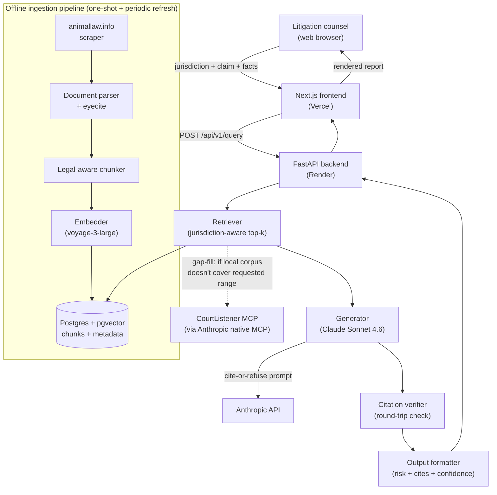

# Stage 2 Design Doc — Litigation Prediction & Strategy

**Project:** Litigation Prediction and Strategy (Open Paws RDP)
**Stage:** 2 — Design & Architecture
**Days:** 3–4
**Date:** 2026-05-26
**Status:** Ready for mentor review

---

## 1. User flow

A litigation counsel visits the site and lands on the Home page. They read the value proposition — verified citations, calibrated refusal, open source — and click "Start analyzing."

On the Analyze page they fill out three fields: jurisdiction (dropdown), legal claim (short text), and facts (free text). Optionally, they toggle CourtListener on and set a date range if they want live case-law gap-filling beyond the local corpus.

They submit. The backend retrieves relevant case chunks, sends them to Claude under a strict cite-or-refuse contract, verifies every citation, and returns a structured report. The report shows on the right side of the same page — no navigation, no new tab.

The report contains: a plain-language risk summary, risk factors with severity badges (high/medium/low) and citations inline, comparable cases with links to source documents, strategic considerations, a confidence band, and any uncertainty notes (e.g. "no 9th Circuit case on point in local corpus").

If the retrieved corpus is too thin to answer honestly, the system returns a refusal — not a hallucinated answer.

The user can click any case citation to open the full document. They can run another query by changing the form. Each query is independent; there is no conversation memory.

The other five pages — How it works, Sources, About & Limitations, Examples — are informational and require no backend call.

---

## 2. System architecture

### How a single query works (retrieve → generate → verify)

The user submits from the Next.js frontend on Vercel. The request hits `POST /api/v1/query` on the FastAPI backend on Render. The backend embeds the query using voyage-3-large and runs a jurisdiction-aware top-k vector search against Postgres + pgvector.

If the CourtListener toggle is on, the backend checks `MAX(decision_date)` in the local corpus for the target jurisdiction. If there is a gap between that date and the user's requested date range end, it calls the CourtListener MCP to fetch only the missing cases, merges them into the retrieval pool, and re-ranks before selecting top-k.

The top-k chunks and the original question go to Claude Sonnet 4.6 under a cite-or-refuse prompt. Claude's output is then run through a citation verifier: every citation is checked against the retrieved chunks. Citations that trace back to a real chunk are marked verified. Citations that don't are dropped and flagged in the response — never shown as if they were real.

The verified output is formatted into a structured response and returned to the frontend.

### Architecture diagram



### The six pages

| Page | Route | Backend call? | Purpose |
|---|---|---|---|
| Home | `/` | No | Value prop, CTA to Analyze |
| Analyze | `/analyze` | Yes — `POST /api/v1/query` | The product. Form + report. |
| How it works | `/how-it-works` | No | Trust page. Pipeline walkthrough, Stanford research, honest limitations. |
| Sources | `/sources` | No | Transparency. Corpus contents, attribution, licensing, refresh cadence. |
| About & Limitations | `/about` | No | Open Paws context, UPL disclaimers, GitHub link. |
| Examples | `/examples` | No | Pre-run query gallery — strong outputs and refusal cases. |

---

## 3. Key wireframes

Two screens wireframed (low-fidelity):

**Analyze page** — left column (~40%): form with jurisdiction dropdown, claim text input, facts textarea, CourtListener toggle + date range (greyed out until toggle is on), submit button. Right column (~60%): structured report — confidence band badge, risk summary, risk factors with severity badges and inline citations, comparable cases with external links, uncertainty notes.

**Home page** — headline + one-sentence value prop, two CTAs (Start analyzing, See examples), three feature callouts (verified citations, calibrated refusal, open source).

The remaining four pages are static content and don't require wireframes at this stage.

---

## 4. Tech stack

| Layer | Choice | Why |
|---|---|---|
| Frontend framework | Next.js (React + TypeScript) | Multi-page site with shared layout; SSR + Vercel deploy out of the box. |
| Styling | Tailwind CSS + shadcn/ui | Professional components without bespoke design work. |
| Frontend hosting | Vercel | Native Next.js host; preview deploys per branch; free tier sufficient. |
| Backend framework | FastAPI (Python 3.12) | Async, typed, auto-generated OpenAPI docs; aligns with Python's legal-NLP ecosystem. |
| Backend hosting | Render | One-dashboard FastAPI + managed Postgres; Git-push deploy; free tier sufficient. |
| Python package manager | uv | Fast, deterministic installs. |
| Database | Postgres 16 + pgvector | One system for relational + vector search; no separate vector DB to operate. |
| LLM | Claude Sonnet 4.6 | Long context for legal docs, strong citation behavior, native MCP support. |
| Embeddings | voyage-3-large | Best retrieval quality in 2026; Anthropic-recommended. |
| Citation parsing | eyecite | Standard US legal citation parser; maintained by Free Law Project (same org as CourtListener). |
| Live case law (opt-in) | CourtListener MCP | Available natively in Claude as of May 2026; used for gap-fill only, not bulk ingestion. |
| Scraping | httpx + selectolax | Static HTML on animallaw.info; no Selenium needed. |
| Dev environment | Docker Compose | One command for fresh-clone setup (Postgres + backend). |
| Backend testing | pytest | Standard. |
| Frontend testing | Vitest | Standard for Next.js. |
| Migrations | Alembic | Standard for SQLAlchemy. |

**Out of scope for Phase 1:** auth, multi-tenancy, document upload, fine-tuning, alternative vector DBs.

---

## 5. Data model

Five tables. All use UUIDs as primary keys, snake_case naming, and include `created_at` / `updated_at`.

### `documents`
One legal document — case opinion, statute, regulation, or article from animallaw.info.

| Column | Type | Notes |
|---|---|---|
| `id` | uuid | PK |
| `source` | text | `'animallaw.info'`, `'courtlistener'`, `'cap'` |
| `source_id` | text | External ID at the source. Unique with `source`. |
| `doc_type` | text | `'case'`, `'statute'`, `'article'`, `'regulation'` |
| `jurisdiction` | text | Normalized: `'US'`, `'US-CA'`, `'US-9th-Cir'`, etc. |
| `court` | text | Court name (nullable for non-case docs) |
| `decision_date` | date | Nullable |
| `title` | text | Case caption or statute title |
| `citation` | text | Bluebook-normalized cite |
| `full_text` | text | Cleaned full text |
| `source_url` | text | Link back to original |
| `metadata` | jsonb | Judge, panel, parallel cites, etc. |

### `chunks`
A semantically-bounded slice of a document with its embedding. The unit the retriever returns.

| Column | Type | Notes |
|---|---|---|
| `id` | uuid | PK |
| `document_id` | uuid | FK → `documents.id` |
| `chunk_index` | int | Order within the document |
| `text` | text | The chunk text |
| `embedding` | vector(1024) | voyage-3-large output |
| `section_type` | text | `'caption'`, `'syllabus'`, `'holding'`, `'discussion'`, `'dissent'` |
| `start_char` / `end_char` | int | Offsets into `documents.full_text` for verification round-trip |
| `metadata` | jsonb | Per-chunk extras |

### `queries`
One user query. Used for evaluation, debugging, and replay.

| Column | Type | Notes |
|---|---|---|
| `id` | uuid | PK |
| `jurisdiction` | text | User-supplied |
| `claim` | text | The legal claim |
| `facts` | text | Free-text facts |
| `raw_request` | jsonb | Full request payload |

### `query_results`
The system's response, with everything needed to debug it.

| Column | Type | Notes |
|---|---|---|
| `id` | uuid | PK |
| `query_id` | uuid | FK → `queries.id` |
| `retrieved_chunk_ids` | uuid[] | What the retriever returned |
| `model_id` | text | e.g. `'claude-sonnet-4-6'` |
| `raw_model_output` | text | Claude's response before verification |
| `verified_citations` | jsonb | Citations that survived |
| `dropped_citations` | jsonb | Citations that failed, with reason |
| `output` | jsonb | Final user-facing structured response |
| `confidence_band` | text | `'low'`, `'medium'`, `'high'`, `'refused'` |
| `latency_ms` | int | Total wall-clock time |

### `citations`
Normalized citation table. Speeds verification and enables analytics.

| Column | Type | Notes |
|---|---|---|
| `id` | uuid | PK |
| `normalized_cite` | text | Bluebook-normalized. Indexed. |
| `document_id` | uuid | FK → `documents.id` if local. Nullable. |
| `extracted_by` | text | `'eyecite'`, `'manual'`, etc. |

---

## 6. API contract

Phase 1 has no auth — single-tenant dev.

### `POST /api/v1/query`
Submit a litigation query. Returns a structured risk assessment or a refusal.

Request:
```json
{
  "jurisdiction": "US-9th-Cir",
  "claim": "Article III standing for organizational plaintiff",
  "facts": "Plaintiff is a 501(c)(3) with members in CA, OR, WA...",
  "options": {
    "k": 10,
    "courtlistener": {
      "enabled": false,
      "date_range": { "start": "2010-01-01", "end": null }
    }
  }
}
```

Response (success):
```json
{
  "query_id": "9f7c...",
  "risk_assessment": {
    "summary": "Standing is the principal risk...",
    "factors": [
      {
        "label": "Organizational vs. associational standing",
        "weight": "high",
        "discussion": "...",
        "citations": ["Havens Realty Corp. v. Coleman, 455 U.S. 363 (1982)"]
      }
    ]
  },
  "comparable_cases": [...],
  "strategic_considerations": ["..."],
  "uncertainty_notes": ["..."],
  "confidence_band": "medium",
  "dropped_claims": [...],
  "model": "claude-sonnet-4-6",
  "latency_ms": 4821
}
```

Response (refusal):
```json
{
  "query_id": "...",
  "refusal": {
    "reason": "Corpus too thin for this jurisdiction; would have to fabricate to answer.",
    "retrieved_chunk_count": 2,
    "minimum_required": 5
  },
  "confidence_band": "refused"
}
```

### Other endpoints

| Endpoint | Purpose |
|---|---|
| `GET /api/v1/documents/{id}` | Full document — metadata + text + source URL |
| `GET /api/v1/chunks/{id}` | Single chunk — text + parent doc + section type |
| `GET /api/v1/examples` | Pre-run example queries + cached outputs |
| `GET /api/v1/health` | Liveness + Postgres + Anthropic API ping |
| `POST /api/v1/admin/ingest` | Trigger ingestion job (dev only) |

---

## 7. Confidence band logic

Three bands — `high`, `medium`, `low` — plus `refused` when retrieval is too thin to attempt generation honestly.

Bands are computed from pipeline signals, not from the model's self-rating (LLM self-reported confidence is poorly calibrated).

Inputs:
- Retrieval quality — top-k similarity scores. Best chunk below threshold → drop a band.
- Citation verification rate — share of generated citations that survived round-trip check. Below ~80% → drop a band.
- Jurisdictional match — share of retrieved chunks whose jurisdiction matches the query target. Low match → drop a band.

Exact thresholds will be calibrated against the Stage 3 test set on Day 6 once real data is flowing.

---

## 8. Stage 3 task breakdown

### Group A — Foundation (Day 5, ~6h)

| Task | Description | Hours |
|---|---|---|
| A1 | Repo scaffold — directory structure, Docker Compose (Postgres + pgvector), uv, Alembic, pytest skeleton, Vitest skeleton | 3h |
| A2 | DB schema + migrations — all 5 tables, `vector(1024)` column, indexes on `embedding`, `jurisdiction`, `decision_date` | 3h |

### Group B — Engine (Days 5–6, ~20h) — critical path

| Task | Description | Hours |
|---|---|---|
| B1 | Seed corpus — 20 hand-curated animal-law cases as JSON fixtures, loaded into DB | 3h |
| B2 | Retriever — jurisdiction-aware top-k pgvector search, as a Python function | 3h |
| B3 | Generator — Claude Sonnet 4.6 integration with cite-or-refuse prompt | 4h |
| B4 | Citation verifier — round-trip check, verified/dropped split | 4h |
| B5 | Confidence band + output formatter — assemble structured response, compute band | 3h |
| B6 | `POST /api/v1/query` — wire B1–B5, smoke test happy path + refusal | 3h |

**Day 7 milestone: a working `POST /api/v1/query` endpoint you can `curl`. No frontend required.**

### Group C — Ingestion pipeline (Days 7–8, ~17h)

| Task | Description | Hours |
|---|---|---|
| C1 | animallaw.info scraper using httpx + selectolax | 4h |
| C2 | Document parser + eyecite citation extraction | 4h |
| C3 | Legal-aware chunker — preserve captions, holdings, dissents as distinct section types | 3h |
| C4 | Embedder (voyage-3-large) + pgvector write | 3h |
| C5 | `POST /admin/ingest` endpoint + background job runner | 3h |

### Group D — CourtListener gap-fill (Day 8, ~4h)

| Task | Description | Hours |
|---|---|---|
| D1 | CourtListener MCP integration — compute `MAX(decision_date)` per jurisdiction, call CL when gap exists, merge + re-rank | 4h |

### Group E — Remaining API + backend tests (Day 9, ~7h)

| Task | Description | Hours |
|---|---|---|
| E1 | `GET /documents/{id}`, `/chunks/{id}`, `/examples`, `/health` | 3h |
| E2 | pytest integration tests — happy path, refusal, gap-fill, citation drop, health check | 4h |

### Group F — Frontend (Days 9–11, ~18h)

| Task | Description | Hours |
|---|---|---|
| F1 | Next.js scaffold — layout, nav, Tailwind + shadcn/ui, shared components | 3h |
| F2 | Analyze page — form + report rendering, CourtListener toggle UX | 5h |
| F3 | Home page | 3h |
| F4 | How it works, Sources, About & Limitations, Examples pages | 4h |
| F5 | Vitest tests + end-to-end smoke test (frontend → backend → response renders) | 3h |

### Group G — Deploy (Day 11, ~5h)

| Task | Description | Hours |
|---|---|---|
| G1 | Render deploy — backend + managed Postgres, env vars, migrate on startup | 3h |
| G2 | Vercel deploy — frontend, point API base URL at Render | 2h |

---

## 9. Critical path

```
A1 → A2 → B1 → B2 → B3 → B4 → B5 → B6 → C1 → C2 → C3 → C4 → C5 → D1 → E2 → F2 → G1
```

Everything else — E1, F1, F3, F4, F5, G2 — runs in parallel or can slide without killing the project.

---

## 10. Build order and justification

**Order:** Database → seed corpus → backend engine → ingestion pipeline → frontend → deploy.

**Database first** because everything depends on it. Low risk, half a day, unlocks everything downstream.

**Seed corpus before pipeline** because 20 hand-curated cases is enough to test the engine. You don't need thousands of cases to prove the core concept works. The full ingestion pipeline is for scale, not for proving correctness.

**Backend engine next — and this is the most important decision.** The citation verifier (B4) and the cite-or-refuse prompt (B3) are the riskiest parts of the entire project. The whole credibility claim of the platform is that every citation traces back to a real retrieved document. If the verifier has holes, or the prompt takes multiple iterations to get right, or Claude doesn't follow the contract reliably — you want to discover that on Day 5, not Day 10 after you've built a frontend on top of it. Build the riskiest piece first.

**Ingestion pipeline after engine** because it's plumbing, not differentiation. It expands corpus size but doesn't change whether the core logic is correct.

**Frontend after backend API is solid** because it's pure UI work. Building a form that calls a thing that doesn't exist yet means doing integration work twice.

**Deploy last** because Render and Vercel are both Git-push workflows — there's no meaningful complexity, just configuration.

---

## 11. Guiding questions

**What's the riskiest part?**
The citation verifier (B4) and the cite-or-refuse prompt (B3). If Claude doesn't follow the prompt reliably, or the verifier has holes, the platform's entire credibility claim falls apart. Getting the prompt right may take several iterations.

**Can you build it first?**
Yes. B3 and B4 only need the database up and 20 seed cases loaded — roughly half a day of setup. The riskiest piece can start Day 5 afternoon.

**What's the smallest end-to-end slice you can ship by Day 7?**
A working `POST /api/v1/query` endpoint. Send it a jurisdiction, a claim, and facts — it retrieves from the seed corpus, generates with Claude under cite-or-refuse, verifies citations, and returns a structured JSON response. No frontend, no full ingestion pipeline. Just proof that the core retrieve → generate → verify loop works end to end.

---

## 12. Integration points and failure modes

| Integration | Purpose | Failure mode | Mitigation |
|---|---|---|---|
| Anthropic API | Generation (Claude Sonnet 4.6) | API down, rate limit | Retry + exponential backoff; surface "service degraded" to user |
| Voyage AI | Embeddings | API down / billing | Local fallback embedder (`bge-large`); degrades quality, surfaces uncertainty note |
| CourtListener MCP | Jurisdiction-scoped gap-fill | MCP unavailable | Query proceeds against local corpus only; uncertainty note flags uncovered date range |
| animallaw.info | Bulk ingestion | Site structure change | Snapshot what we have; ingestion failures don't block live queries |
| Postgres + pgvector | Storage + vector search | DB down | Backend returns 503; fatal — no graceful fallback |
| Vercel | Frontend hosting | Outage | Site down; communicate via status page |
| Render | Backend + Postgres hosting | Outage | Same as Vercel |

---

*Stage 2 complete. Awaiting mentor review before Stage 3 (Development) begins.*
